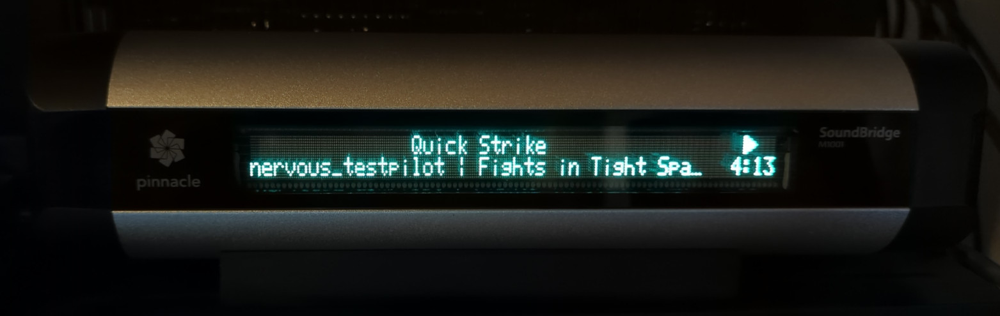

# chromecastsoundbridge

Display your currently playing songs on that beautiful display of your ancient Roku / Pinnacle SoundBridge M1001!

This was adapted from https://github.com/sh0oki/chromecastslack which was an excellent starting point. Thank you, sh0oki!

The script will look for active Chromecasts in your LAN (you can specify filters), then display the currently playing song on the display of the specified Soundbridge via its network port and the `sketch` feature.

I tested this script with Python >= 3.10.12. Other versions should work, but haven't been tested.

This script is intended to run permanently on a server (e.g. NAS) and as such aims to gracefully handle the Chromecast and/or Soundbridge going offline for extended periods of time. I haven't tested it in that mode yet, as the script is **still work in progress** and full of debug output / logspam. Use at your own risk.

## Setup
1. Have a working Chromecast in your LAN, playing music from your favorite source (Spotify, Soundcloud, ...).
1. Install *chromecastsoundbridge* on any computer / server in your LAN.
1. Specify your Chromecast's name and the IP address of the SoundBridge when launching `listener.py` ([see below](#usage))

## Installing
```
git clone git@github.com:mikerofone/chromecastsoundbridge.git
cd chromecastsoundbridge
pip3 install -r ./requirements.txt
```

## Usage
```
CHROMECAST_FILTER="Living Room" SOUNDBRIDGE_IP=192.168.13.37 python3 ./listener.py python3 listener.py
```
Use your favorite init script to execute the script after restart.
*CHROMECAST_FILTER* is optional, though I haven't tested what happens when more than one Chromecast is connected.

## Demo

Here's my Pinnacle SoundBridge M1001 showing me what's currently playing on a Chromecast Audio in my network:


